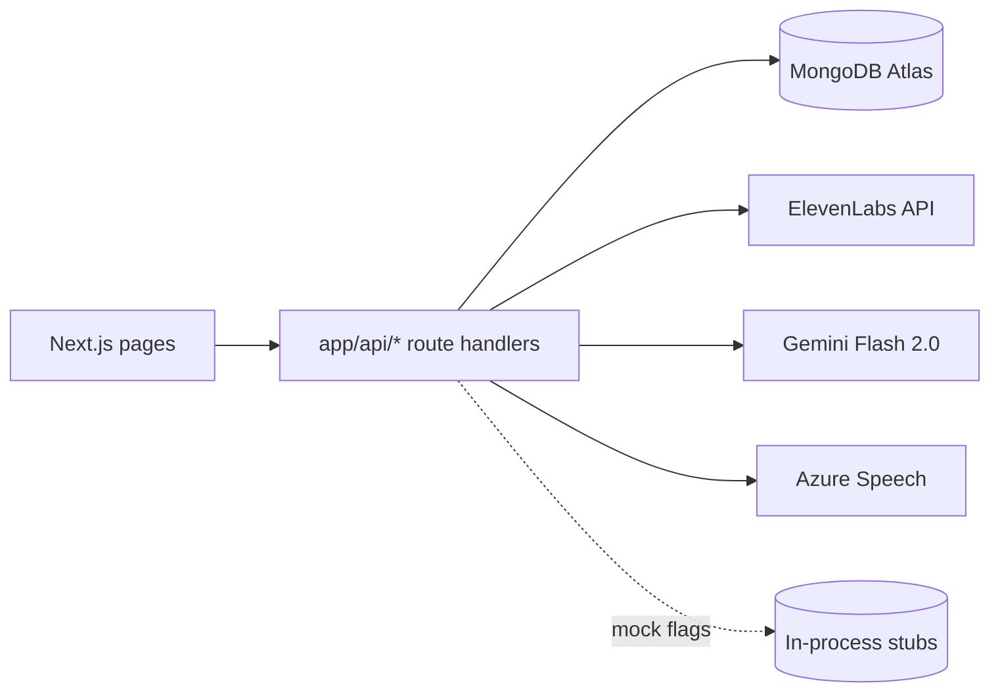

## Architecture decision

The plan in `voicelegacy-plan.md` specifies a Next.js full-stack monorepo with built-in API routes, and there is already a working route at [frontend/app/api/voice/upload/route.ts](frontend/app/api/voice/upload/route.ts) using `runtime = "nodejs"`, `NextResponse`, and a `MOCK_VOICE_API` env flag. We will extend that pattern. The `backend/` folder stays untouched (reserved for a future worker if needed).

## Shared infrastructure

- Add `mongodb` driver to [frontend/package.json](frontend/package.json).
- New `frontend/src/lib/mongodb.ts` — cached `MongoClient` (reused across hot reloads via `globalThis`, the standard Next.js pattern).
- New `frontend/src/lib/db.ts` — typed collection getters: `getUsersCollection()`, `getPhrasesCollection()`. Schemas mirror the plan's `User` and `Phrase` shapes.
- New `frontend/src/lib/env.ts` — central reader for `MONGODB_URI`, `ELEVENLABS_API_KEY`, `GEMINI_API_KEY`, `AZURE_SPEECH_KEY`, `AZURE_SPEECH_REGION`, plus mock flags `MOCK_VOICE_API`, `MOCK_GEMINI_API`, `MOCK_AZURE_API`, `MOCK_DB` (in-memory fallback for dev without Atlas).
- New `frontend/src/lib/api.ts` — small helpers `jsonOk`, `jsonError(message, status)`, `requireBody<T>()`, mirroring the error-shape (`{ success, error }`) used by the existing voice/upload route.
- New `frontend/src/lib/elevenlabs.ts`, `frontend/src/lib/gemini.ts`, `frontend/src/lib/azure.ts` — thin clients so route handlers stay short. The existing ElevenLabs voice-add logic from `voice/upload/route.ts` moves into `elevenlabs.ts` (route becomes a thin wrapper) so `/api/speak` can reuse it.

## API routes (all under `frontend/app/api/`)

| Route | File | Behavior |
|---|---|---|
| `POST /api/user/create` | `user/create/route.ts` | Body: `{ consent: true, communicationStyle, audience? }`. Rejects without consent. Inserts User with `voiceStatus: "none"`, returns `{ userId }`. |
| `GET /api/user/[id]` | `user/[id]/route.ts` | Returns user profile or 404. |
| `POST /api/voice/upload` | (existing) | Keep current ElevenLabs + mock logic. ADD: accept `userId` form field, persist returned `voice_id` and flip `voiceStatus` to `"ready"` on the user doc. |
| `GET /api/voice/status/[id]` | `voice/status/[id]/route.ts` | Returns `{ voiceStatus, voiceId? }` for the given user id. |
| `GET /api/phrases/[userId]` | `phrases/[userId]/route.ts` | Returns all phrases for user; supports `?category=` query filter. |
| `POST /api/phrases` | `phrases/route.ts` | Body: `{ userId, category, text, isFavorite? }`. Validates category against the 6 enums in the plan. |
| `DELETE /api/phrases/[id]` | `phrases/[id]/route.ts` | Delete a single phrase by id (also enforce `userId` match via header or body to prevent cross-user delete). |
| `POST /api/gemini/suggest` | `gemini/suggest/route.ts` | Body: `{ category, count? }`. Prompt: `"Suggest N meaningful phrases for the [category] category for someone preserving their voice"`. Returns `{ suggestions: string[] }`. Mockable. |
| `POST /api/gemini/rewrite` | `gemini/rewrite/route.ts` | Body: `{ message, mode: "warmer"\|"shorter"\|"sound_like_me", communicationStyle }`. Returns `{ rewritten }`. Mockable. |
| `POST /api/speak` | `speak/route.ts` | Body: `{ text, voiceId }`. Calls ElevenLabs TTS (`/v1/text-to-speech/{voiceId}`), streams MPEG audio back with `Content-Type: audio/mpeg`. Mockable (returns a tiny silent MP3 in mock mode). |
| `POST /api/azure/transcribe` | `azure/transcribe/route.ts` | Multipart audio in → text out, used by `/record` to verify the user is reading the right prompt. Mockable. |

Routes will mirror the existing route's shape: `runtime = "nodejs"`, `NextResponse.json({ success, ... })`, structured `console.error` on failure, mock-mode short-circuit when the relevant env flag is set.

## Validation and IDs

- Use `ObjectId` from `mongodb` for `_id`s; helper `toObjectId(str)` returns 400 on invalid ids.
- Category enum centralised in `frontend/src/lib/types.ts` and reused by both the phrases POST handler and the Gemini suggest endpoint.
- Bodies parsed with a small hand-rolled validator in `lib/api.ts` (no Zod dependency unless we hit something complex — keeps the dep list lean).

## Env / config

Update [frontend/.gitignore](frontend/.gitignore) is already covered. Add `frontend/.env.local.example` documenting every variable from the plan + the four mock flags. Do NOT create `.env.local` itself.

## Out of scope for this pass

- Frontend pages / UI work (`/`, `/record`, `/phrases`, `/speak`, `/dashboard`) — the plan said "strictly backend".
- Auth / sessions — the plan uses raw `userId` passed from client; we'll keep that.
- The `backend/` folder stays empty.